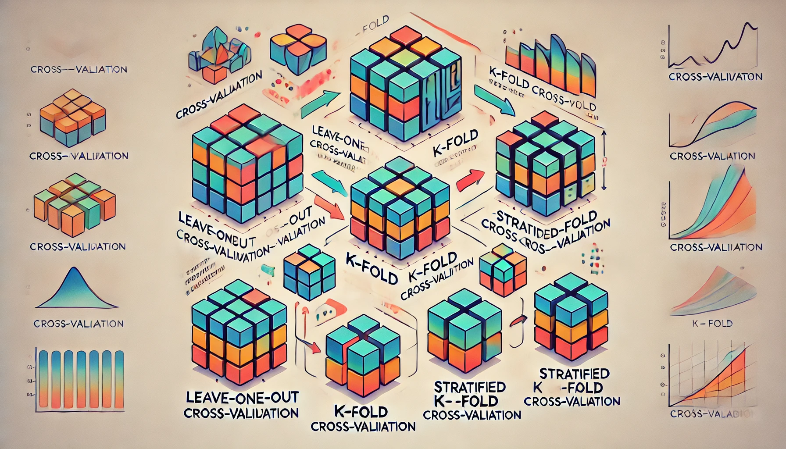

# Cross-Validation in Machine Learning

## Blog Milestones
- Background info
- Why cross-validation?
- What is cross-validation?
  - Types
  - Applications
- Code Implementation
  - Manually
  - Scikit-learn Library
- Recommendation and Inferences

---

## Background Info
In building any ML model, there are certain steps commonly followed such as data preprocessing, data partitioning into train/test, training, and evaluating. Technically, training is performed on the train set, the model is tuned on the validation set, and evaluated on the test set. It is seen that different sets of data from the same dataset yield different metric scores which creates uncertainty in model performance. Hence, cross-validation comes into the picture for an accurate estimate of the model.

---

## Why Cross-Validation?
To create a model, training is performed on train data and tested on test data which needs the whole data to be divided in the following different ways.

### 1. Use Whole Data as Train/Test
Model uses whole data to train and also to test, which makes no sense. This would be like studying only the exam questions and getting 100% on the test.

### 2. Split Data into Train and Test
Data is divided into train and test sets in a ratio-wise manner using `train_test_split` from scikit-learn.

### 3. Cross-Validation
Cross-validation involves dividing the data into several train/test splits, training, and evaluating on each split, and averaging the results for a more reliable model performance estimate.

---

## What is Cross-Validation?
Cross-Validation is a resampling technique to make our model sure about its efficiency and accuracy on unseen data. It is essentially a model validation technique, useful in other applications as well.

### Quick Steps:
1. Divide data into K partitions (folds).
2. Treat one fold as a test set while the remaining K-1 folds as the train set.
3. Compute the score of the test fold.
4. Repeat for all folds, treating each as the test set once.
5. Average the scores from all folds to get the final accuracy.

---

## Types of Cross-Validation

### Leave-One-Out Cross-Validation (LOOCV)
- Each record is used as a test set once, while all others are used as the train set.
- Results in as many iterations as records, making it computationally expensive.

### K-Fold Cross-Validation
- Data is divided into K partitions.
- Model trains on K-1 folds and tests on the Kth fold.
- Repeats for each fold as the test set, averaging the results.

### Stratified K-Fold Cross-Validation
- An improved version of K-Fold where each fold maintains the percentage of each target class.
- Helps prevent data imbalance, especially in classification problems.

---

## Applications of Cross-Validation
- Improving model via hyper-parameter tuning.
- Comparing models to help in choosing one.
- Selecting the best features for the model.

---

## Illustration of Different Types of Cross-Validation

---

## Recommendation and Inferences
Cross-Validation is a robust technique for estimating model performance, avoiding overfitting, and selecting the best model and hyperparameters. Choosing the right type of cross-validation method depends on the dataset size, model complexity, and computational power.

---

## Conclusion
Cross-validation is a powerful tool that helps in building reliable and efficient models by providing a better estimate of model performance on unseen data. It ensures that our model generalizes well and is not just overfitting to the training data.

---

## Happy Learning!
