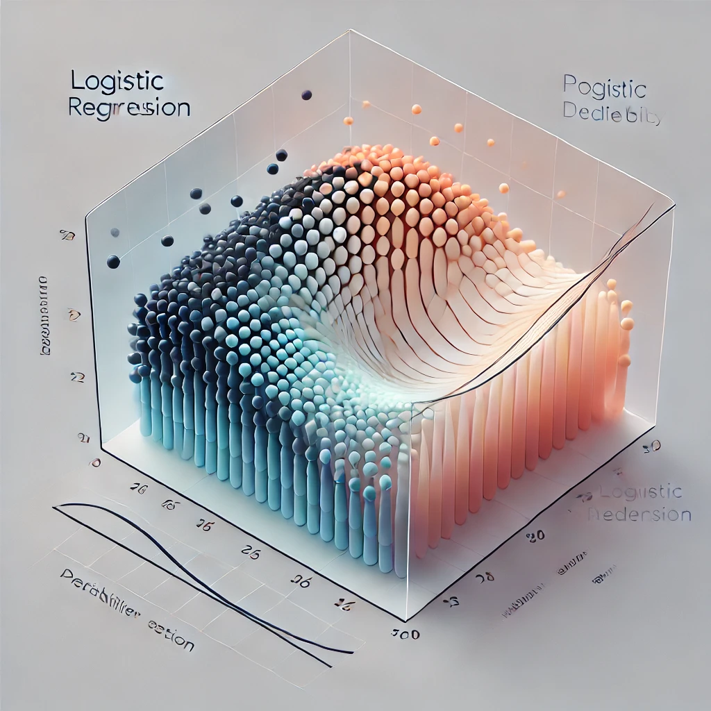

# Understanding Logistic Regression

## Introduction
Logistic Regression is a supervised statistical technique used to determine the probability of a dependent variable (classes present in the variable). It utilizes logit functions to establish relationships between dependent and independent variables by predicting probabilities.

## Types of Logistic Regression
1. **Binary Logistic Regression**: The dependent variable has only two possible outcomes/classes (e.g., Male or Female).
2. **Multinomial Logistic Regression**: The dependent variable has three or more possible outcomes/classes without ordering (e.g., Predicting food quality - Good, Great, Bad).
3. **Ordinal Logistic Regression**: The dependent variable has three or more possible outcomes/classes with ordering (e.g., Star rating from 1 to 5).

## Assumptions of Logistic Regression
- Does not require a linear relationship between dependent and independent variables.
- Error terms do not need to be normally distributed.
- Homoscedasticity is not required.
- Assumes minimal or no multicollinearity among independent variables (checked using Variance Inflation Factor - VIF).
- Assumes independent variables are linearly related to the log of odds (checked using the Box-Tidwell test).
- Requires a large sample for good predictions.
- Assumes observations are independent.
- No influential values (outliers) in continuous predictors (checked using IQR, z-score, box plots, or violin plots).

## Why Not Use Linear Regression for Classification?
- Linear Regression predicts continuous values, making it hard to define class thresholds.
- In multi-class problems, it forces a numerical relationship between classes, which may not be meaningful.
- The best-fit line might produce values outside the expected range (e.g., below 0 or above 4 in a 5-class problem).

## The Logistic Model
- Unlike Linear Regression, Logistic Regression maps outputs between 0 and 1 using the sigmoid function.
- Interpretation of coefficients involves the rate of change of log odds rather than direct probabilities.

## Odds Ratio and Logit
- **Odds**: The ratio of the probability of success to failure.
- **Logit**: The logarithm of the odds ratio.
- Example: If the probability of success is 0.6, then:
  - Odds(Success) = 0.6/0.4 = 1.5
  - Odds(Failure) = 0.4/0.6 = 0.66667

## Decision Boundary
- A decision boundary separates classes in a classification problem.
- Logistic Regression determines an appropriate decision boundary to classify new data points accurately.

## Cost Function in Logistic Regression
- Measures model performance by calculating error between predicted and actual values.
- The cost function of Logistic Regression is different from Linear Regression due to its non-linear sigmoid function.
- The presence of a sigmoid function results in a convex cost function, which helps in optimization.
- Uses negative log-likelihood to ensure cost values remain positive.

## Gradient Descent in Logistic Regression
- An optimization algorithm used to minimize the cost function.
- Steps:
  1. Initialize weights and set a small learning rate (e.g., 0.01 or 0.0001).
  2. Compute the partial derivative of the cost function.
  3. Update weights iteratively using the formula:
     - `w = w - learning_rate * derivative_of_cost_function`
  4. Repeat until convergence.
- Gradient Descent ensures the cost function reaches the global minimum by updating weights iteratively.

## Evaluating the Logistic Regression Model
1. **Pseudo R-Squared (McFadden’s R-Squared)**: Measures model predictive power.
2. **Akaike Information Criteria (AIC)**: Estimates model fit; lower AIC values indicate a better model.
3. **Confusion Matrix, Precision, Recall, and F1-Score**: Measures model accuracy and performance.
4. **ROC-AUC Curve**: Evaluates classification capability and determines optimal thresholds.
## Illustration of Logistic Regression Model

## Conclusion
Logistic Regression is an essential technique for classification tasks, offering probabilistic interpretations of predictions. While it has its limitations, understanding its assumptions, cost function, and gradient descent process can significantly improve model performance and accuracy.

## Additional Learning Resources
- Read research papers and blogs on Logistic Regression.
- Watch educational videos on YouTube.
- Experiment with Logistic Regression models using Python and real-world datasets.

**Happy Learning!**

