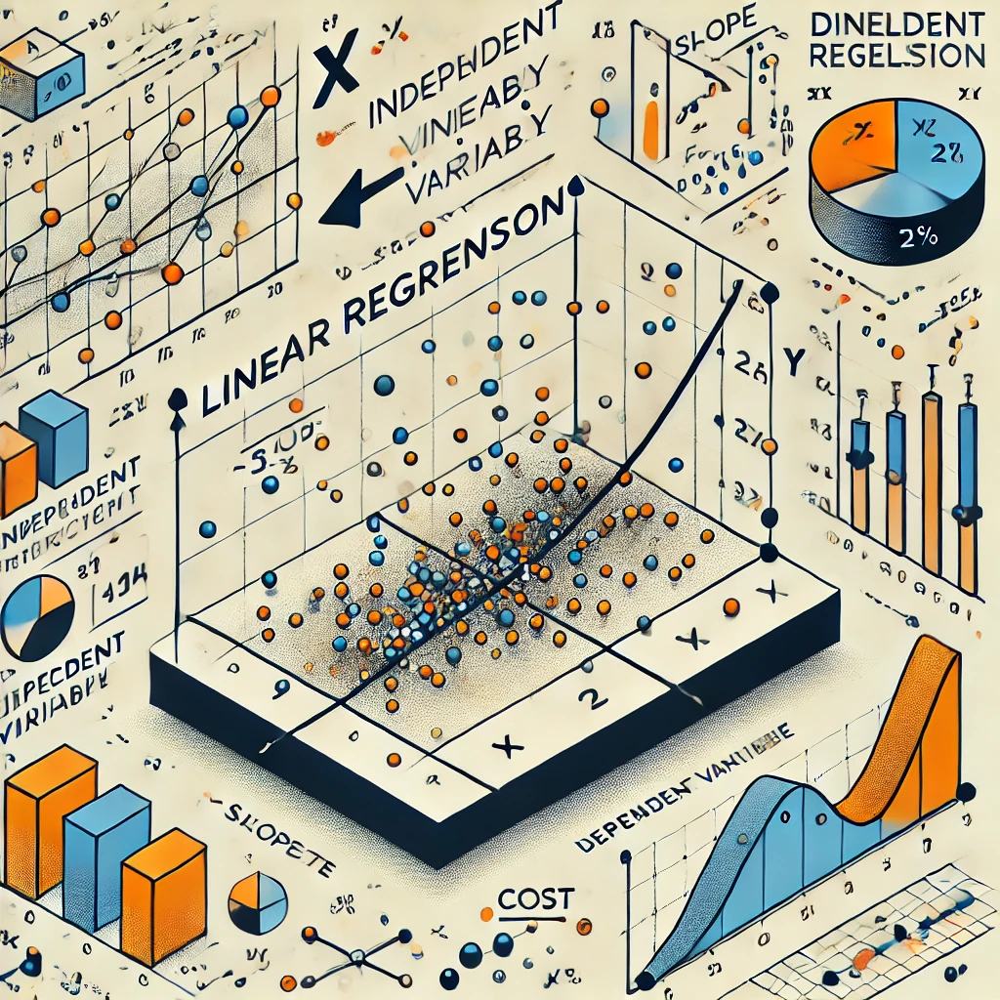

# Understanding Linear Regression

## What is Linear Regression?

Linear Regression is a statistical supervised learning technique to predict the quantitative variable 
by forming a linear relationship with one or more independent features.

It helps determine:
- If an independent variable does a good job in predicting the dependent variable.
- Which independent variable plays a significant role in predicting the dependent variable.

## Assumptions of Linear Regression

Before performing Linear Regression analysis, it's essential to be aware of the following assumptions to 
ensure the model performs at its best:

1. **Linearity:** The independent variables should be linearly related to the dependent variables. 
   - Can be examined using Scatter plots, Heatmaps, or Pairplots.

2. **Normal Distribution:** Every feature in the data should be normally distributed. 
   - Checked using Q-Q plots, histograms, etc.

3. **No Multicollinearity:** There should be little or no multicollinearity in the data.
   - Verified using Variance Inflation Factor (VIF).

4. **Mean of Residuals is Zero:** Residuals (difference between observed and predicted values) 
   should have a mean close to zero.

5. **Normal Distribution of Residuals:** Residuals should be normally distributed.
   - Verified using Q-Q Plot on residuals.

6. **Homoscedasticity:** The variance of the residuals should be constant throughout the data.
   - Checked using Residual vs Fitted Plot.

7. **No Autocorrelation:** Residuals should be independent of each other, particularly in time series data.
   - Verified using Durbin-Watson test or ACF plot.

## Visual Representation

To visualize the concept of Linear Regression, here's an illustration depicting the relationship 
between an independent variable and a dependent variable, along with slopes and intercepts:

This conceptual image captures the foundational idea of fitting a straight line through data points, 
representing the linear relationship in Linear Regression.
