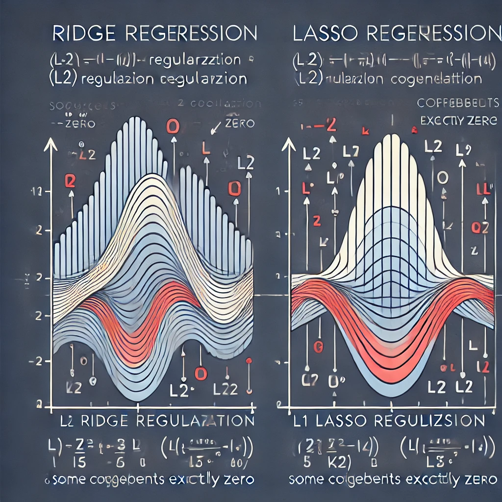
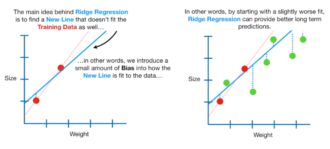
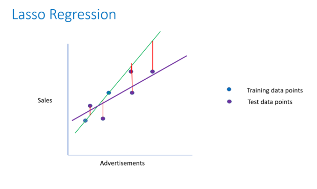

# Understanding Ridge and Lasso Regression

## Introduction

Regression analysis is a cornerstone method in data science, enabling professionals to predict continuous values 
based on input features. With data-driven decision-making becoming increasingly critical across industries, mastering 
various regression techniques is essential for data engineers and data scientists. 

Among these, **Lasso** and **Ridge Regression** stand out as two widely-used regularization techniques that enhance 
model performance and aid in feature selection.

In this article, we will explore the concepts and applications of these methods, highlight their key differences, and 
provide practical Python examples to demonstrate their implementation.

## What is Regression?

Regression is a type of statistical technique used in data science to analyze the relationship between variables.

It typically involves finding the line of best fit for a given set of data points, estimating how much variation 
can be explained by that model, and predicting the value of one variable (known as the dependent variable) based on 
the values of others (known as independent variables).

## Ridge Regression

**Ridge Regression**, also known as **L2 regularization**, is an extension to linear Regression that introduces a 
regularization term to reduce model complexity and help prevent overfitting.

- It is an important tool in statistical analysis, adding a regularization term to the linear Regression equation.
- It helps reduce model complexity while preserving interpretability and preventing overfitting.
- It is a useful technique for many data science problems.

## Lasso Regression

**Lasso** (Least Absolute Shrinkage and Selection Operator) **Regression** is another regularization technique 
that prevents overfitting in linear Regression models.

- Like Ridge Regression, Lasso Regression adds a regularization term to the linear Regression objective function.
- The difference lies in the loss function used — Lasso Regression uses **L1 regularization**, which aims to 
  minimize the sum of the absolute values of coefficients multiplied by penalty factor λ.

## Difference Between Ridge and Lasso Regression

Ridge and Lasso Regression differ primarily in the type of regularization term they use:
- **Ridge Regression (L2 regularization):** Shrinks coefficients evenly, preventing overfitting without setting any 
  coefficients to zero.
- **Lasso Regression (L1 regularization):** Can shrink some coefficients to exactly zero, effectively performing 
  feature selection.

## Visual Representation

To better understand the differences between Ridge and Lasso Regression, here's a comparative illustration:

This image highlights how Ridge Regression smooths coefficient values, while Lasso Regression can set some coefficients 
to zero, aiding in feature selection.

