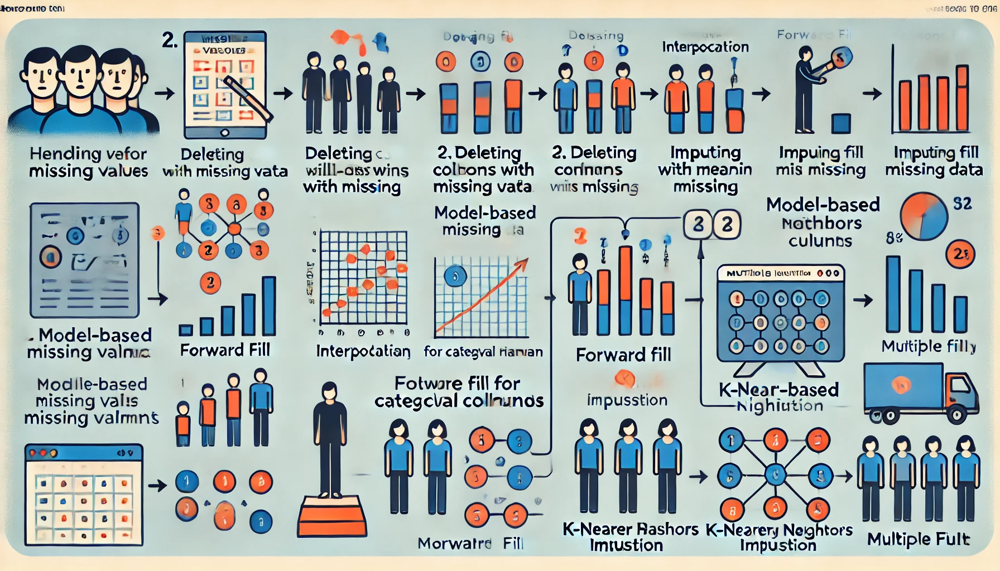

# Handling Missing Values in Dataset — 9 Methods That You Need to Know

While working with data, it is common for data scientists to encounter missing values. Handling these missing values is crucial because most machine learning algorithms do not support them. Even if some algorithms like KNN and Naive Bayes can handle missing values, the results could be skewed, affecting model performance.  

There is no one-size-fits-all solution for handling missing values, as different problems (e.g., time series, ML, regression) require different approaches. This article explores the types of missing values and various ways to handle them.

---

## Types of Missing Values

1. **Missing Completely at Random (MCAR):**  
   Missing values occur completely at random without any pattern.  
   Example: Customer feedback not given randomly after a service call.

2. **Missing at Random (MAR):**  
   Missing values depend on other observed variables in the dataset.  
   Example: Men are less likely to answer skincare-related questions in a survey.

3. **Missing Not at Random (MNAR):**  
   Missing values are related to unobserved data and not explained by other variables.  
   Example: High-income people may refuse to disclose income in surveys.

---

## How to Detect Missing Values
- `df.info()` — Displays non-null counts for each feature.
- `df.isnull().sum()` — Shows the count of null values for each column.

---

## Methods to Handle Missing Data

### 1. **Deleting the Column with Missing Data**  
Remove columns with a high percentage of missing values.  
```python
df = df.drop(['deck'], axis=1)
```
### 2. **Deleting the Row with Missing Data**  
Remove rows containing at least one null value.  
```python
updated_df = df.dropna(axis=0, inplace=True)
```
### 3. **Imputing with Mean/Median**
Replace missing values in numerical columns with mean or median.
```python
df['age'] = df['age'].fillna(df['age'].mean(), inplace=True)
```
#### 3.1. **Group-wise Imputation**
Impute by calculating mean or median within groups.

```python
df['age'] = df['age'].fillna(df.groupby('class')['age'].transform('mean'))
```
### 4. **Imputation for Categorical Columns**
Replace missing values with the most frequent category or create a new category.

```python
df['deck'] = df['deck'].fillna('H')
```
### 5. **Forward Fill and Backward Fill**
Fill missing values with the last (ffill) or next (bfill) non-missing value.

```python
df['column_name'].fillna(method='ffill', inplace=True)
df['column_name'].fillna(method='bfill', inplace=True)
```
### 6. **Interpolation**
Fill missing values based on adjacent data points, useful for time-series data.

```python
df.interpolate(method='linear', inplace=True)
```
### 7. **Model-Based Imputation (Regression Model)**
Use predictive models to estimate missing values.

```python
from sklearn.linear_model import LinearRegression
model = LinearRegression()
model.fit(X_train, y_train)
y_pred = model.predict(X_test)
```
### 8. **Multiple Imputation (Iterative Imputer)**
Impute using multiple features by implementing the MICE algorithm.

```python
from sklearn.experimental import enable_iterative_imputer
from sklearn.impute import IterativeImputer
impute_it = IterativeImputer()
impute_it.fit_transform(X)
```
### 9. **K-Nearest Neighbors Imputation (KNNImputer)**
Estimate missing values based on the nearest neighbors in the feature space.

## Illustration of Different Types of Handling Missing Values



### **Conclusion**
Handling missing values effectively is crucial for building robust machine learning models. Depending on the data and problem type, one or a combination of these methods can be used. Choose wisely to maintain data integrity and model performance.

Note: Experiment with different techniques and validate model performance to select the most suitable method.